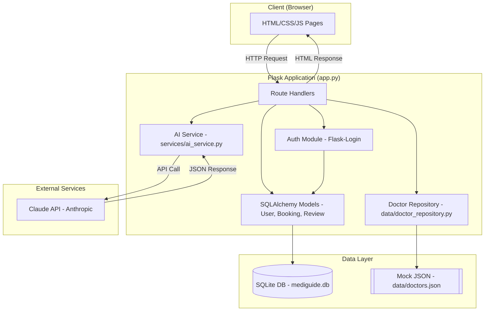
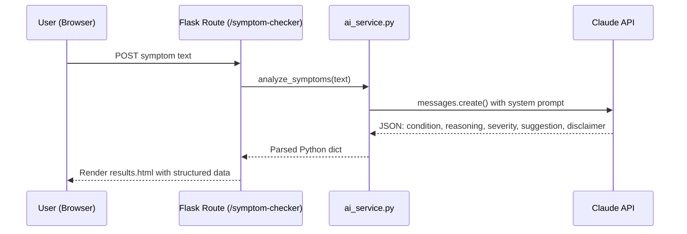
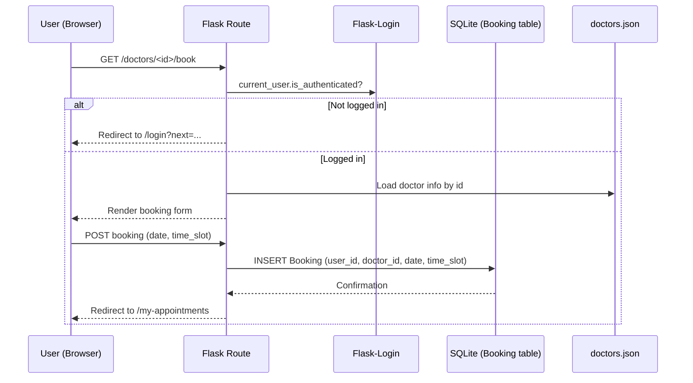
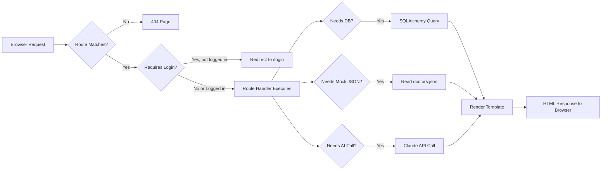

# MediGuide — System Architecture

Version 1.0 | Day 2 Deliverable | AB Talks 60-Day Claude Challenge Capstone

---

## 1. Tech Stack (Finalized)

| Layer | Choice | Reasoning |
|---|---|---|
| Backend | Python + Flask | Matches strongest skill (Python); lightweight, minimal boilerplate, ideal for a 10-day solo build |
| Frontend | HTML + CSS + JavaScript (Jinja2 templates) | No build step, no framework overhead, fastest path to a working UI |
| Database | SQLite + Flask-SQLAlchemy | Zero-config, file-based, free; ORM avoids raw SQL and speeds up development |
| Authentication | Flask-Login + Werkzeug (hashed PIN) | Secure, standard session handling without custom crypto code |
| AI Model | Claude API (Anthropic) via official `anthropic` Python SDK | Real reasoning-based symptom analysis, as scoped in PRD |
| Hosting | Render.com (free web service tier) | Free, GitHub-connected auto-deploy, supports Flask + gunicorn |
| Other Tools | python-dotenv, gunicorn, Git/GitHub | Standard, free, low-friction tooling |

---

## 2. Component Diagram

---

## 3. Data Flow — Symptom Checker

---

## 4. Data Flow — Appointment Booking (Login-Gated)

---

## 5. Request Lifecycle (General Pattern)

---

## 6. AI Interaction Detail

- **Trigger:** User submits free-text symptoms via `/symptom-checker` (POST).
- **Prompt design:** System prompt instructs Claude to respond in strict JSON only, with fields: `condition`, `reasoning`, `severity` (`mild` | `uncertain-serious`), `otc_suggestion` (nullable), `specialist_type` (nullable), `disclaimer`.
- **Safety behavior:** Claude is instructed to be reasonably confident for clearly mild cases, but default to `uncertain-serious` + specialist recommendation whenever symptoms are ambiguous.
- **Failure handling:** If the API call fails or returns invalid JSON, the app shows a graceful fallback message rather than crashing (wrapped in try/except).
- **No conversation memory:** Each symptom check is a single, stateless API call — no chat history is stored or sent.

---

## 7. External Services

| Service | Purpose | Failure Handling |
|---|---|---|
| Claude API (Anthropic) | Symptom analysis | Try/except wrapper; user sees a friendly error message and can retry |
| Render.com | Hosting | N/A (infrastructure, not runtime-dependent) |

No other external services are used in v1.0 (no maps API, no SMS/OTP API, no payment gateway) — consistent with PRD's explicit exclusions.
