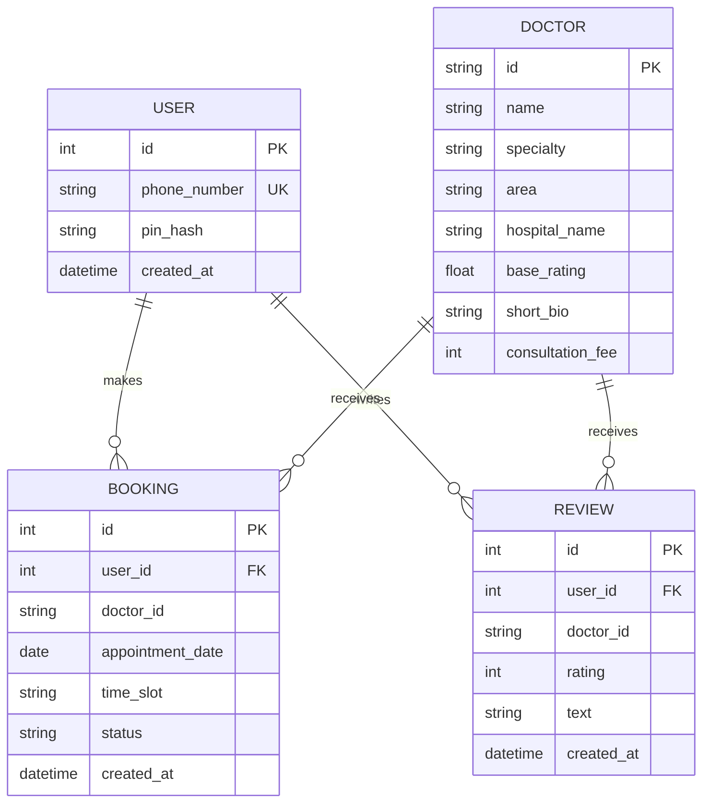

# MediGuide — Database Schema

Version 1.0 | Day 2 Deliverable

---

## 1. Overview

MediGuide uses a **hybrid data model**:
- **SQLite (via SQLAlchemy)** for dynamic, user-generated data: `users`, `bookings`, `reviews`.
- **Mock JSON file** (`data/doctors.json`) for static reference data: doctors/hospitals. This is intentional per the PRD (mock data, no real doctor database needed for v1.0).

---

## 2. Entity Relationship Diagram



> Note: `DOCTOR` lives in `data/doctors.json`, not in SQLite. `doctor_id` in `BOOKING` and `REVIEW` is a plain string field that references the JSON entry's `id` — there is no enforced foreign key at the database level (SQLite can't reference an external JSON file), so this link is validated in application code instead.

---

## 3. Table Definitions

### 3.1 `users`

| Field | Type | Constraints | Notes |
|---|---|---|---|
| id | Integer | Primary Key, Auto-increment | |
| phone_number | String(15) | Unique, Not Null | Basic 10-digit validation in app code |
| pin_hash | String(255) | Not Null | Hashed via werkzeug `generate_password_hash` — never store raw PIN |
| created_at | DateTime | Not Null, default=now | |

### 3.2 `bookings`

| Field | Type | Constraints | Notes |
|---|---|---|---|
| id | Integer | Primary Key, Auto-increment | |
| user_id | Integer | Foreign Key → users.id, Not Null | |
| doctor_id | String(20) | Not Null | References an id in doctors.json |
| appointment_date | Date | Not Null | |
| time_slot | String(20) | Not Null | e.g., "10:00 AM" |
| status | String(20) | Not Null, default="confirmed" | Values: confirmed / cancelled |
| created_at | DateTime | Not Null, default=now | |

### 3.3 `reviews`

| Field | Type | Constraints | Notes |
|---|---|---|---|
| id | Integer | Primary Key, Auto-increment | |
| user_id | Integer | Foreign Key → users.id, Not Null | |
| doctor_id | String(20) | Not Null | References an id in doctors.json |
| rating | Integer | Not Null, 1–5 | Validated in app code |
| text | Text | Not Null | Cannot be empty (app-level validation) |
| created_at | DateTime | Not Null, default=now | |

### 3.4 `doctors.json` (mock reference data, not a DB table)

Each entry:
```json
{
  "id": "doc_001",
  "name": "Dr. Ansh Verma",
  "specialty": "General Physician",
  "area": "Delhi - Karol Bagh",
  "hospital_name": "Karol Bagh City Clinic",
  "base_rating": 4.3,
  "short_bio": "10+ years experience in general medicine and preventive care.",
  "consultation_fee": 500,
  "seed_reviews": [
    { "reviewer_label": "Patient", "rating": 5, "text": "Very thorough and patient." }
  ]
}
```

---

## 4. Relationships Summary

- One **User** → many **Bookings** (1:N)
- One **User** → many **Reviews** (1:N)
- One **Doctor** (JSON) → many **Bookings** (1:N, referenced by string ID)
- One **Doctor** (JSON) → many **Reviews** (1:N, referenced by string ID)

---

## 5. Validation Against PRD User Stories

| User Story (from PRD) | Schema Support |
|---|---|
| Browse doctors without login | `doctors.json` is read-only, publicly queryable, no user table dependency |
| Sign up with phone + PIN | `users.phone_number` (unique) + `users.pin_hash` |
| Log in and stay logged in | Flask-Login session references `users.id` |
| Book an appointment | `bookings` row created with `user_id` + `doctor_id` |
| View my appointments | Query `bookings WHERE user_id = current_user.id` |
| Reschedule an appointment | UPDATE `bookings.appointment_date` / `time_slot` |
| Cancel an appointment | UPDATE `bookings.status = 'cancelled'` |
| View reviews (seeded + real) | Combine `doctors.json.seed_reviews` + `reviews WHERE doctor_id = X` |
| Submit a review (logged in only) | INSERT into `reviews` with `user_id` + `doctor_id` |
| Only I can edit/cancel my own booking | App-level check: `booking.user_id == current_user.id` |

All PRD user stories are fully supported by this schema — no gaps identified.

---

## 6. Constraints & Integrity Rules (Enforced in App Code)

- A user cannot book/review without being authenticated (`@login_required`).
- A user can only reschedule/cancel bookings where `booking.user_id == current_user.id` (403 otherwise).
- `rating` must be an integer between 1 and 5.
- `review.text` and `phone_number` cannot be empty strings.
- `doctor_id` referenced in bookings/reviews must exist in `doctors.json` (validated at write time).
