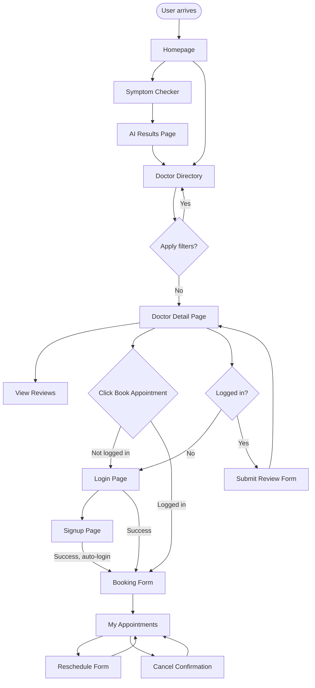
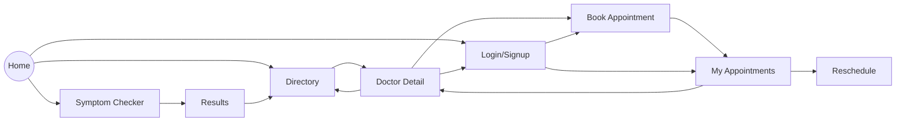

# MediGuide — UI & User Flow

Version 1.0 | Day 2 Deliverable

---

## 1. User Flow Diagram



---

## 2. Screen Inventory (Every Screen and Its Reason)

| # | Screen | Reason it Exists |
|---|---|---|
| 1 | Homepage | Entry point; explains the product and routes to the two core actions |
| 2 | Symptom Checker (input) | Where the AI-guidance journey begins |
| 3 | Results Page | Displays AI's condition, reasoning, suggestion, disclaimer |
| 4 | Doctor Directory | Hero feature; browsing without login friction |
| 5 | Doctor Detail | Full info + entry point to booking and reviews |
| 6 | Signup | Required for booking/reviews |
| 7 | Login | Required for returning users |
| 8 | Booking Form | Core conversion action |
| 9 | My Appointments | Manage existing bookings (view/reschedule/cancel) |
| 10 | Reschedule Form | Update an existing booking |
| 11 | Review Submission (embedded in Detail page) | Let users contribute trust signals |
| 12 | 404 / Error Page | Graceful handling of broken/unknown routes |

Every screen maps directly to a PRD feature or a supporting navigation need — no extra screens.

---

## 3. Screen Flow (Navigation Map)



Navbar (persistent on all pages): **Logo/Home | Symptom Checker | Find Doctors | My Appointments (if logged in) | Login/Signup or Logout**

---

## 4. Low-Fidelity Wireframes

### 4.1 Homepage
```
+--------------------------------------------------+
| MediGuide      [Symptom Checker] [Doctors] [Login]|
+--------------------------------------------------+
|                                                    |
|   Know what's wrong. Know what to do next.        |
|   [ Check My Symptoms ]  [ Find a Doctor ]         |
|                                                    |
|   [ How it works: 1-2-3 icons ]                   |
|                                                    |
+--------------------------------------------------+
```

### 4.2 Symptom Checker (Input)
```
+--------------------------------------------------+
| MediGuide      [Symptom Checker] [Doctors] [Login]|
+--------------------------------------------------+
|  Describe your symptoms                           |
|  +----------------------------------------------+ |
|  | [ free text area                            ] | |
|  +----------------------------------------------+ |
|  [ Analyze Symptoms ]                              |
+--------------------------------------------------+
```

### 4.3 Results Page
```
+--------------------------------------------------+
| Likely Condition: Common Cold                     |
| Severity: MILD                                    |
|--------------------------------------------------|
| Reasoning: Based on your fever + sore throat...   |
|--------------------------------------------------|
| Suggested OTC: Paracetamol, rest, fluids          |
|--------------------------------------------------|
| ⚠ This is not a medical diagnosis...              |
+--------------------------------------------------+
|  [ Find a Doctor Nearby ]                         |
+--------------------------------------------------+
```

### 4.4 Doctor Directory
```
+--------------------------------------------------+
| Filters: [Specialty v] [Area v]                   |
+--------------------------------------------------+
| [Card: Dr. X | Specialty | Area | ★4.3]           |
| [Card: Dr. Y | Specialty | Area | ★4.6]           |
| [Card: Dr. Z | Specialty | Area | ★4.1]           |
+--------------------------------------------------+
```

### 4.5 Doctor Detail
```
+--------------------------------------------------+
| Dr. X — Specialty | Hospital Name | ★4.3          |
| Bio: ...                                          |
| Fee: ₹500                                         |
| [ Book Appointment ]                              |
|--------------------------------------------------|
| Reviews (12)                                      |
| ★★★★★ "Very thorough..."                          |
| [ Write a review ] (if logged in)                 |
+--------------------------------------------------+
```

### 4.6 Login / Signup
```
+--------------------------------------------------+
|  Phone Number: [__________]                       |
|  PIN:          [____]                             |
|  [ Login ]     New here? [Sign up]                |
+--------------------------------------------------+
```

### 4.7 Booking Form
```
+--------------------------------------------------+
| Book with Dr. X                                   |
| Date: [ date picker ]                             |
| Time Slot: [ 10AM v ]                              |
| [ Confirm Booking ]                                |
+--------------------------------------------------+
```

### 4.8 My Appointments
```
+--------------------------------------------------+
| Dr. X | 24 Jul, 10AM | CONFIRMED  [Reschedule][Cancel] |
| Dr. Y | 20 Jul, 3PM  | CANCELLED                    |
+--------------------------------------------------+
```

---

## 5. Navigation Rules

- Directory and Symptom Checker are always public — zero login friction to explore.
- Booking, My Appointments, and Review submission always check login state first; unauthenticated users are redirected to Login with a `next` param so they land back where they intended after logging in.
- Navbar dynamically shows Login/Signup or Logout + My Appointments depending on session state.
